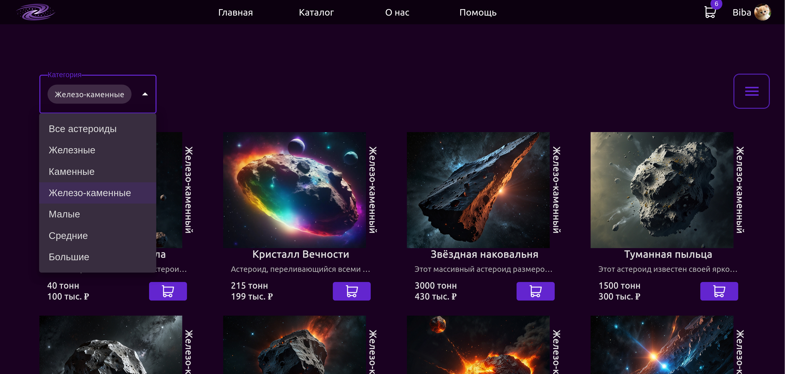
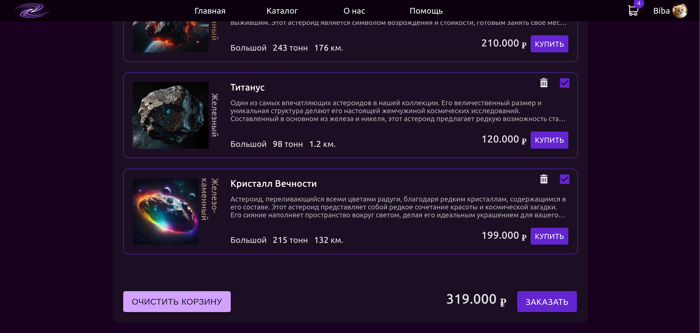
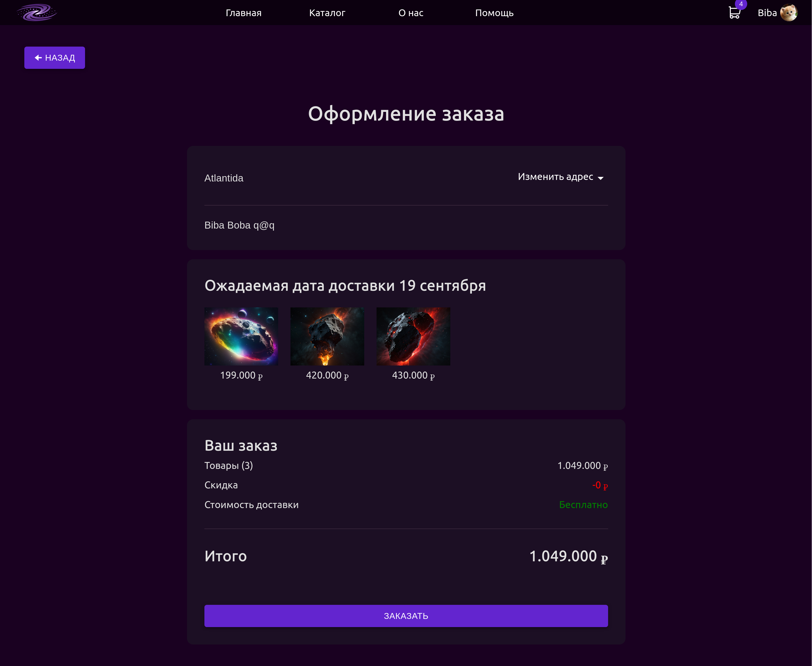

# AsteroidShop
Статус: <span style="background:green; padding: 2px; border-radius:5px">В разработке</span>

Добро пожаловать в **AsteroidShop** — учебный проект, созданный в рамках курсовой работы. Этот веб-приложение представляет собой интернет-магазин астероидов, демонстрирующий мои навыки в области веб-разработки.

## Описание проекта

Проект включает полный цикл разработки интернет-магазина, от серверной части до пользовательского интерфейса, с применением следующих технологий:

- **Frontend**: React с использованием библиотеки компонентов MUI и анимаций Framer Motion для создания плавных и интерактивных интерфейсов.
- **Backend**: FastAPI на Python, обеспечивающий быструю и эффективную обработку запросов и SQLAlchemy для работы с базой данных.
- **База данных**: PostgreSQL для надежного хранения информации о товарах, пользователях и заказах.
- **Стилизация**: Адаптивный дизайн на CSS для поддержки различных устройств (*в разработке*).

## Установка и запуск

### Шаги установки

1. **Клонирование репозитория**:
```shell
git clone https://github.com/Uvoi/AsteroidShop.git
```
2. **Настройка Backend**:
- Установка зависимостей:
```shell
cd backend
pip install -r requirements.txt
```
- Запуск сервера:
```shell
uvicorn main:app --reload
```

3. **Настройка Frontend**
- Установка зависимостей
```shell
npm i
```
- Запуск фронтенд-сервера
```shell
npm start
```

## Использование

После запуска приложения, перейдите на `http://localhost:3000`, чтобы получить доступ к интернет-магазину.
### Основные функции

- **Каталог астероидов**: Возможность фильтрации по различным параметрам.
- **Корзина**: Добавление астероидов в корзину и оформление заказа.
- **Профиль**: Возможность отслеживания статуса доставки и отмены заказа.
- **Административная панель**: Управление товарами, пользователями и заказами.(*В разработке*)

## Скриншоты и демонстрации

**Главная**


**Каталог**


**Корзина**


**Заказ**


**Профиль**

## Цель курсовой работы

Основной целью проекта является демонстрация навыков создания полнофункционального веб-приложения с использованием современных технологий. Проект охватывает разработку и интеграцию серверной и клиентской частей, работу с базами данных, а также создание удобного и анимированного пользовательского интерфейса.

## Контакты

Если у вас возникли вопросы или предложения, вы можете связаться со мной по электронной почте.

---

**Контакт**: iovu_dmtr@yahoo.com
